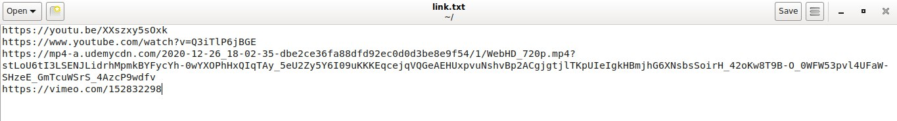

<h1 align="center"> Music and Video Downlaoder </h1>

 With this application you can download music
    and videos from different platforms such as YouTube, Vimeo and Udemy. 

<h2> Table of contents </h2>
<ul> <li> <a href="#RQ"> Requeriments </a> </li>
<li> <a href="#SP"> How does it work? </a> </li>
<li> <a href="#EP"> Execute the program </a> </li> </ul>

<h2 id="RQ"> Requirements </h2>

 This script runs on Debian GNU/Linux systems and
    you must be install pip3 and Tkinter. 

 Type this: 

<pre> $ sudo apt-get update && sudo apt-get -y install ffmpeg python3-pip python3-tk </pre>
<pre> $ pip3 install youtube-dl </pre>
<h2 id="SP"> How does it work? </h2>
<h3> Step 1 </h3>

 Create a text file and enter the links within it. 

<h3> Step 2 </h3>

 When you run the program,
    and select the file with the links. 

<h3> Step 3 </h3>

 Select the folder where the 					
    videos or songs are saved. 

<h3> Step 4 </h3>

 Finally select the download option
    of the selected format and wait. 

<h2 id="EP"> Execute the program </h2>

 Type the following in your terminal: 

<pre> $ git clone https://github.com/kevin-23/youtube-dl-gui.git </pre>
<pre> $ cd youtube-dl-gui </pre>
<pre> $ python3 music-video-downloader.py </pre>
